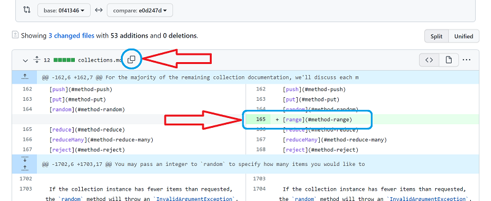

# Содействие в переводе документации

## Процесс актуализации документации (основного репозитория без ответвлений «донора»)

> Раздел, описывающий поток действий, для их дальнейшей автоматизации.

Процесс актуализации состоит из трех этапов:

1. **Прямое сравнение изменений** двух коммитов, сделанных в основном репозитории оригинала документации.
    - На странице коммитов интересующей ветки (например, https://github.com/russsiq/laravel-docs-ru/commits/8.x) ищем последний коммит, содержащий фразу `[compare] xxxxxxx..yyyyyyy`. Копируем часть `yyyyyyy` (например, `0f41346`).
    - На странице коммитов оригинала документации (например, https://github.com/laravel/docs/commits/8.x) копируем 7 символов последнего коммита (например, `e0d247d`).
    - Переходим на страницу https://github.com/laravel/docs/compare/0f41346...e0d247d#files_bucket
2. **Внесение изменений** в виде переведенных строк в соответствующую ветку текущего репозитория.
    
    - Копируем название файла, нажав кнопку, выделенную голубым кружком.
    - Переходим в редактор и с помощью комбинации клавиш <kbd>Ctrl+P</kbd> переходим к редактируемому файлу.
    - Переходим в браузер и копируем содержимое `[range](#method-range)` измененной строки `165`.
    - Переходим в редактор и с помощью комбинации клавиш <kbd>Ctrl+G</kbd> переходим к редактируемой строке.
    - Вносим необходимые изменения в каждый файл, попутно выполняя переводы на русский язык.
3. **Фиксация изменений** с помощью системы контроля версий, пометив коммит в уже знакомом формате `[compare] 0f41346..e0d247d`
