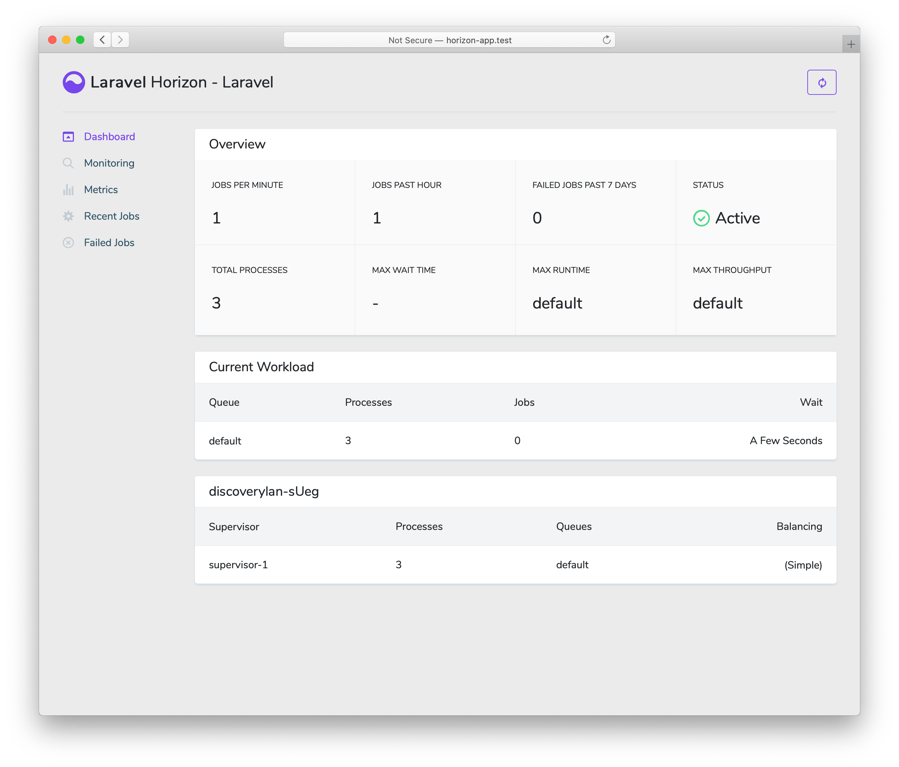

# Laravel 9 · Пакет Laravel Horizon

- [Введение](#introduction)
- [Установка](#installation)
    - [Конфигурирование](#configuration)
    - [Стратегии балансировки](#balancing-strategies)
    - [Авторизация доступа к панели управления](#dashboard-authorization)
- [Обновление Horizon](#upgrading-horizon)
- [Запуск Horizon](#running-horizon)
    - [Развертывание Horizon](#deploying-horizon)
- [Метки](#tags)
- [Уведомления](#notifications)
- [Метрики](#metrics)
- [Удаление невыполненных заданий](#deleting-failed-jobs)
- [Очистка заданий из очередей](#clearing-jobs-from-queues)

<a name="introduction"></a>
## Введение

> {tip} Прежде чем углубиться в Laravel Horizon, вам следует ознакомиться с базовыми [службами очередей](queues.md) Laravel. Horizon дополняет очередь Laravel дополнительным функционалом, которые могут сбивать с толку, если вы еще не знакомы с основным функционалом очереди, предлагаемыми Laravel.

[Laravel Horizon](https://github.com/laravel/horizon) предлагает красивую панель управления и конфигурацию на основе кода для ваших [очередей Redis](queues.md), работающих на Laravel. Horizon позволяет легко отслеживать ключевые показатели вашей системы очередей, такие как пропускная способность, время выполнения и сбои заданий.

При использовании Horizon вся ваша конфигурация обработчика очереди хранится в одном простом файле конфигурации. Определив конфигурацию обработчиков вашего приложения в файле с контролем версий, вы можете легко масштабировать или изменять обработчики очереди вашего приложения при развертывании приложения.



<a name="installation"></a>
## Установка

> {note} Laravel Horizon требует, чтобы вы использовали [Redis](https://redis.io) для управления вашей очередью. Следовательно, вы должны убедиться, что ваше соединение с очередью установлено на `redis` в конфигурационном файле `config/queue.php` вашего приложения.

Для начала установите Horizon с помощью менеджера пакетов Composer в свой проект:

```shell
composer require laravel/horizon
```

После установки Horizon опубликуйте его ресурсы с помощью команды `horizon:install` Artisan:

```shell
php artisan horizon:install
```

<a name="configuration"></a>
### Конфигурирование

После публикации ресурсов Horizon его основной конфигурационный файл будет расположен по адресу `config/horizon.php`. Этот конфигурационный файл позволяет вам настроить параметры обработчика очереди для вашего приложения. Каждый параметр конфигурации включает описание своего назначения, поэтому обязательно внимательно изучите этот файл.

> {note} Horizon внутренне использует соединение Redis с именем `horizon`. Данное имя соединения Redis зарезервировано и не должно назначаться другому соединению Redis в конфигурационном файле `database.php` или в качестве значения параметра `use` в конфигурационном файле `horizon.php`.

<a name="environments"></a>
#### Окружение

После установки основным параметром конфигурации Horizon, с которым вы должны ознакомиться, является параметр `environments`. Этот параметр конфигурации представляет собой массив сред, в которых работает ваше приложение, и определяет параметры рабочего процесса для каждого окружения. По умолчанию эта запись содержит окружение `production` и `local`. Однако вы можете добавлять дополнительные среды по мере необходимости:

    'environments' => [
        'production' => [
            'supervisor-1' => [
                'maxProcesses' => 10,
                'balanceMaxShift' => 1,
                'balanceCooldown' => 3,
            ],
        ],

        'local' => [
            'supervisor-1' => [
                'maxProcesses' => 3,
            ],
        ],
    ],

Когда вы запускаете Horizon, он будет использовать параметры конфигурации рабочего процесса для окружения, в котором работает ваше приложение. Обычно окружение определяется значением [переменной окружения](configuration.md#determining-the-current-environment) `APP_ENV`. Например, окружение `local` Horizon по умолчанию настроено на запуск трех рабочих процессов и автоматический баланс количества рабочих процессов, назначенных каждой очереди. Окружение `production` по умолчанию настроено на запуск максимум 10 рабочих процессов и автоматический баланс количества рабочих процессов, назначенных каждой очереди.

> {note} Вы должны убедиться, что часть `environments` вашего конфигурационного файла `config/horizon.php` содержит запись для каждого [окружения](configuration.md#environment-configuration), на котором вы планируете запускать Horizon.

<a name="supervisors"></a>
#### Supervisors

Как вы можете видеть в конфигурационном файле Horizon по умолчанию каждое окружение может содержать один или более диспетчеров процессов. По умолчанию в конфигурационном файле этот диспетчер определяется как `supervisor-1`; однако вы можете называть своих диспетчеров процессов как хотите. Каждый диспетчер процессов, по сути, отвечает за «наблюдение» за группой рабочих процессов и заботится о балансировке рабочих процессов по очередям.

Вы можете добавить дополнительных диспетчеров процессов в конкретное окружение, если хотите определить новую группу рабочих процессов, которые должны выполняться в этом окружении. Вы можете сделать это, если хотите определить другую стратегию балансировки или количество рабочих процессов для конкретной очереди, используемой вашим приложением.

<a name="default-values"></a>
#### Значения по умолчанию

В конфигурационном файле Horizon, созданном по умолчанию, вы заметите параметр конфигурации `defaults`. Этот параметр конфигурации определяет значения по умолчанию для [диспетчеров процессов](#supervisors) вашего приложения. Значения `defaults` будут объединены с конфигурацией диспетчеров процессов для каждого окружения, что позволит вам избежать ненужного повторения при определении диспетчеров процессов.

<a name="balancing-strategies"></a>
### Стратегии балансировки

В отличие от стандартной системы очередей Laravel, Horizon позволяет вам выбирать из трех стратегий балансировки обработчиков: `simple`, `auto` и `false`. Стратегия `simple`, которая используется в конфигурационном файле по умолчанию, равномерно распределяет входящие задания между процессами обработчиков:

    'balance' => 'simple',

Стратегия `auto` регулирует количество процессов обработчиков в очереди на основе текущей рабочей нагрузки очереди. Например, если ваша очередь `notifications` имеет 1000 ожидающих заданий, а ваша очередь `render` пуста, то Horizon будет выделять больше обработчиков в вашу очередь `notifications`, пока она не станет пустой.

При использовании стратегии `auto` вы можете определить параметры конфигурации `minProcesses` и `maxProcesses` для управления минимальным и максимальным количеством процессов обработчиков, которые Horizon должен погранично масштабировать:

    'environments' => [
        'production' => [
            'supervisor-1' => [
                'connection' => 'redis',
                'queue' => ['default'],
                'balance' => 'auto',
                'minProcesses' => 1,
                'maxProcesses' => 10,
                'balanceMaxShift' => 1,
                'balanceCooldown' => 3,
                'tries' => 3,
            ],
        ],
    ],

Значения конфигурации `balanceMaxShift` и `balanceCooldown` определяют, насколько быстро Horizon будет масштабироваться в соответствии с требованиями обработчиков. В приведенном выше примере каждые три секунды будет создаваться или уничтожаться максимум один новый процесс. Вы можете изменять эти значения по мере необходимости в зависимости от потребностей вашего приложения.

Когда для параметра `balance` установлено значение `false`, то будет использоваться поведение Laravel по умолчанию, которое обрабатывает очереди в том порядке, в котором они перечислены в вашей конфигурации.

<a name="dashboard-authorization"></a>
### Авторизация доступа к панели управления

Доступ к панели управления Horizon можно получить по маршруту `/horizon`. По умолчанию вы сможете получить доступ к этой панели управления только в локальном (`local`) окружении. Однако в поставщике `App\Providers\HorizonServiceProvider` есть определение [шлюза авторизации](authorization.md#gates). Этот шлюз авторизации контролирует доступ к Horizon в **нелокальных** окружениях. Вы можете изменить этот шлюз, чтобы ограничить доступ к вашей установке Horizon, если это необходимо:

    /**
     * Зарегистрировать шлюз авторизации Horizon.
     *
     * Этот шлюз определяют, кто может получить доступ к Horizon в нелокальных окружениях.
     *
     * @return void
     */
    protected function gate()
    {
        Gate::define('viewHorizon', function ($user) {
            return in_array($user->email, [
                'taylor@laravel.com',
            ]);
        });
    }

<a name="alternative-authentication-strategies"></a>
#### Альтернативные стратегии аутентификации

Помните, что Laravel автоматически внедрит аутентифицированного пользователя в замыкание шлюза авторизации. Если ваше приложение обеспечивает безопасность Horizon с помощью другого метода, например через ограничения по IP-адресам, то пользователям Horizon может не потребоваться «вход в систему». Следовательно, вам нужно будет изменить сигнатуру замыкания `function ($user)`, указанную выше, на `function ($user = null)`, чтобы указать Laravel не требовать аутентификации.

<a name="upgrading-horizon"></a>
## Обновление Horizon

При обновлении до новой основной версии Horizon важно внимательно изучить [руководство по обновлению](https://github.com/laravel/horizon/blob/master/UPGRADE.md). Кроме того, при обновлении до любой новой версии Horizon вам следует повторно опубликовать веб-активы Horizon:

```shell
php artisan horizon:publish
```

Чтобы поддерживать веб-активы в актуальном состоянии и избежать проблем при будущих обновлениях, вы можете добавить команду `horizon:publish` в блок `post-update-cmd` раздела `scripts` в файле `composer.json` вашего приложения:

```json
{
    "scripts": {
        "post-update-cmd": [
            "@php artisan horizon:publish --ansi"
        ]
    }
}
```

<a name="running-horizon"></a>
## Запуск Horizon

После того, как вы настроили своих диспетчеров и обработчиков процессов в конфигурационном файле `config/horizon.php` вашего приложения, то вы можете запустить Horizon, используя команду `horizon` Artisan. Эта единая команда запустит все сконфигурированные обработчики процессов для текущего окружения:

```shell
php artisan horizon
```

Вы можете приостановить процесс Horizon и дать ему указание продолжить обработку заданий, используя команды `horizon:pause` и `horizon:continue` Artisan:

```shell
php artisan horizon:pause

php artisan horizon:continue
```

Вы также можете приостановить и продолжить конкретные [диспетчеры](#supervisors) Horizon, используя команды `horizon:pause-supervisor` и `horizon:continue-supervisor` Artisan:

```shell
php artisan horizon:pause-supervisor supervisor-1

php artisan horizon:continue-supervisor supervisor-1
```

Вы можете проверить текущий статус процесса Horizon, используя команду `horizon:status` Artisan:

```shell
php artisan horizon:status
```

Вы можете корректно завершить процесс Horizon, используя команду `horizon:terminate` Artisan. Любые задания, которые в настоящее время обрабатываются, будут выполнены, а затем Horizon остановит свой процесс:

```shell
php artisan horizon:terminate
```

<a name="deploying-horizon"></a>
### Развертывание Horizon

Когда вы будете готовы развернуть Horizon на производственном сервере вашего приложения, вам следует настроить монитор процесса для отслеживания команды `php artisan horizon` и перезапустить ее, если она неожиданно завершится. Не волнуйтесь, ниже мы обсудим, как установить монитор процессов.

Во время процесса развертывания вашего приложения вы должны дать команду Horizon завершить процесс, чтобы он был перезапущен вашим монитором процессов и получил изменения вашего кода:

```shell
php artisan horizon:terminate
```

<a name="installing-supervisor"></a>
#### Установка Supervisor

Supervisor – это монитор процесса для операционной системы Linux, который автоматически перезапустит ваш процесс `horizon`, если он перестанет выполняться. Чтобы установить Supervisor в Ubuntu, вы можете использовать следующую команду. Если вы не используете Ubuntu, то вы, вероятно, можете установить Supervisor с помощью диспетчера пакетов вашей операционной системы:

```shell
sudo apt-get install supervisor
```

> {tip} Если настройка Supervisor сама по себе кажется утомительной, рассмотрите возможность использования [Laravel Forge](https://forge.laravel.com), который автоматически установит и настроит Supervisor для ваших проектов Laravel.

<a name="supervisor-configuration"></a>
#### Конфигурирование Supervisor

Конфигурационные файлы Supervisor обычно хранятся в каталоге `/etc/supervisor/conf.d` вашего сервера. В этом каталоге вы можете создать любое количество файлов конфигурации, которые инструктируют диспетчера процессов, как следует контролировать ваши процессы. Например, давайте создадим файл `horizon.conf`, который запускает и отслеживает процесс `horizon`:

```ini
[program:horizon]
process_name=%(program_name)s
command=php /home/forge/example.com/artisan horizon
autostart=true
autorestart=true
user=forge
redirect_stderr=true
stdout_logfile=/home/forge/example.com/horizon.log
stopwaitsecs=3600
```

При определении конфигурации Supervisor вы должны убедиться, что значение `stopwaitsecs` больше, чем количество секунд, затраченных вашим самым продолжительным заданием. В противном случае Supervisor может убить задание до завершения его обработки.

> {note} Хотя приведенные выше примеры действительны для серверов на базе Ubuntu, расположение и расширение файла, ожидаемые от файлов конфигурации Supervisor, могут различаться в разных серверных операционных системах. Пожалуйста, обратитесь к документации вашего сервера для получения дополнительной информации.

<a name="starting-supervisor"></a>
#### Запуск Supervisor

После создания файла конфигурации вы можете обновить конфигурацию Supervisor и запустить отслеживаемые процессы, используя следующие команды:

```shell
sudo supervisorctl reread

sudo supervisorctl update

sudo supervisorctl start horizon
```

> {tip} Для получения дополнительной информации о запуске Supervisor обратитесь к [документации Supervisor](http://supervisord.org/index.html).

<a name="tags"></a>
## Метки

Horizon позволяет назначать «метки» заданиям, включая почтовые отправления, транслируемые события, уведомления и слушатели событий в очереди. Фактически, Horizon будет интеллектуально и автоматически помечать большинство заданий в зависимости от моделей Eloquent, прикрепленных к заданию. Например, взгляните на следующее задание:

    <?php

    namespace App\Jobs;

    use App\Models\Video;
    use Illuminate\Bus\Queueable;
    use Illuminate\Contracts\Queue\ShouldQueue;
    use Illuminate\Foundation\Bus\Dispatchable;
    use Illuminate\Queue\InteractsWithQueue;
    use Illuminate\Queue\SerializesModels;

    class RenderVideo implements ShouldQueue
    {
        use Dispatchable, InteractsWithQueue, Queueable, SerializesModels;

        /**
         * Экземпляр Video.
         *
         * @var \App\Models\Video
         */
        public $video;

        /**
         * Создать новый экземпляр задания.
         *
         * @param  \App\Models\Video  $video
         * @return void
         */
        public function __construct(Video $video)
        {
            $this->video = $video;
        }

        /**
         * Выполнить задание.
         *
         * @return void
         */
        public function handle()
        {
            //
        }
    }

Если это задание поставлено в очередь с экземпляром `App\Models\Video` с атрибутом `id` равным `1`, оно автоматически получит тег `App\Models\Video:1`. Это потому, что Horizon будет искать в свойствах задания любые модели Eloquent. Если модели Eloquent будут найдены, то Horizon интеллектуально пометит задание, используя имя класса и первичный ключ модели:

    use App\Jobs\RenderVideo;
    use App\Models\Video;

    $video = Video::find(1);

    RenderVideo::dispatch($video);

<a name="manually-tagging-jobs"></a>
#### Самостоятельное назначение меток заданиям

Если вы хотите вручную определить метки для одного из ваших объектов в очереди, вы можете определить метод `tags` для класса:

    class RenderVideo implements ShouldQueue
    {
        /**
         * Получить метки, которые должны быть назначены заданию.
         *
         * @return array
         */
        public function tags()
        {
            return ['render', 'video:'.$this->video->id];
        }
    }

<a name="notifications"></a>
## Уведомления

> {note} При настройке Horizon для отправки уведомлений Slack или SMS необходимо ознакомиться с [предварительной подготовкой для соответствующего канала уведомлений](notifications.md).

Если вы хотите получать уведомления, когда одна из ваших очередей имеет длительное время ожидания, то вы можете использовать методы `Horizon::routeMailNotificationsTo`, `Horizon::routeSlackNotificationsTo` и `Horizon::routeSmsNotificationsTo`. Как правило, вызов этих методов осуществляется в методе `boot` поставщика `App\Providers\HorizonServiceProvider`:

    /**
     * Загрузка любых служб приложения.
     *
     * @return void
     */
    public function boot()
    {
        parent::boot();

        Horizon::routeSmsNotificationsTo('15556667777');
        Horizon::routeMailNotificationsTo('example@example.com');
        Horizon::routeSlackNotificationsTo('slack-webhook-url', '#channel');
    }

<a name="configuring-notification-wait-time-thresholds"></a>
#### Настройка пороговых значений времени ожидания уведомлений

Вы можете определить количество секунд «долгого ожидания» в конфигурационном файле `config/horizon.php` вашего приложения. Параметр `waits` конфигурации в этом файле позволяет вам контролировать порог длительного ожидания для каждой комбинации соединение / очередь:

    'waits' => [
        'redis:default' => 60,
        'redis:critical,high' => 90,
    ],

<a name="metrics"></a>
## Метрики

Horizon содержит панель показателей, которая предоставляет информацию о времени ожидания и пропускной способности вашего задания и очереди. Для заполнения информационной панели, вы должны добавить команду `snapshot` Artisan так, чтобы она запускалась, например, каждые пять минут через [планировщик](scheduling.md):

    /**
     * Определить расписание выполнения команд приложения.
     *
     * @param  \Illuminate\Console\Scheduling\Schedule  $schedule
     * @return void
     */
    protected function schedule(Schedule $schedule)
    {
        $schedule->command('horizon:snapshot')->everyFiveMinutes();
    }

<a name="deleting-failed-jobs"></a>
## Удаление невыполненных заданий

Если вы хотите удалить невыполненное задание, то вы можете использовать команду `horizon:forget`. Команда `horizon:forget` принимает идентификатор (ID или UUID) неудачного задания в качестве своего единственного аргумента:

```shell
php artisan horizon:forget 5
```

<a name="clearing-jobs-from-queues"></a>
## Очистка заданий из очередей

Если вы хотите удалить все задания из очереди по умолчанию вашего приложения, то вы можете сделать это с помощью команды `horizon:clear` Artisan:

```shell
php artisan horizon:clear
```

Вы можете передать параметр `queue` для удаления заданий из конкретной очереди:

```shell
php artisan horizon:clear --queue=emails
```
