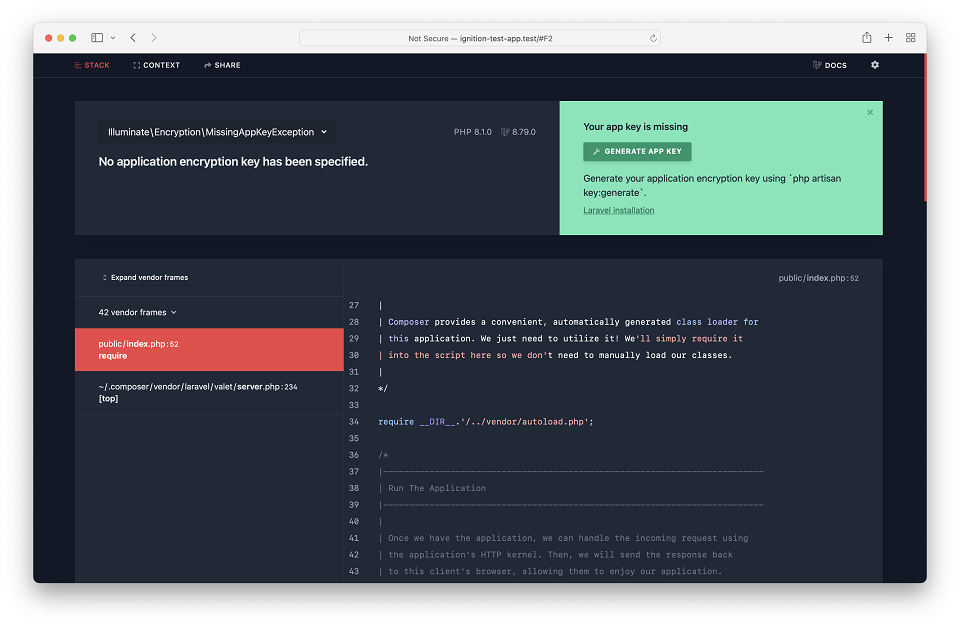
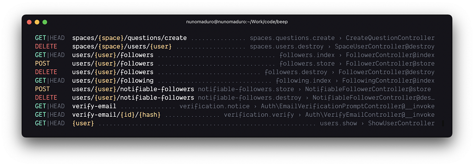
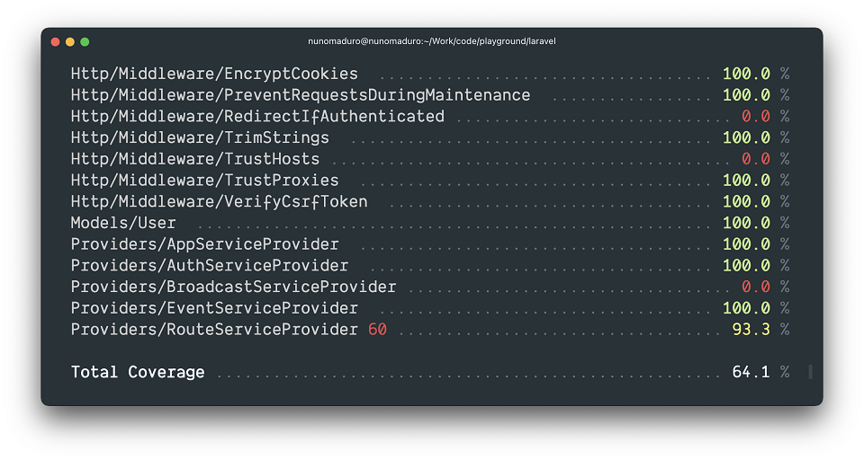
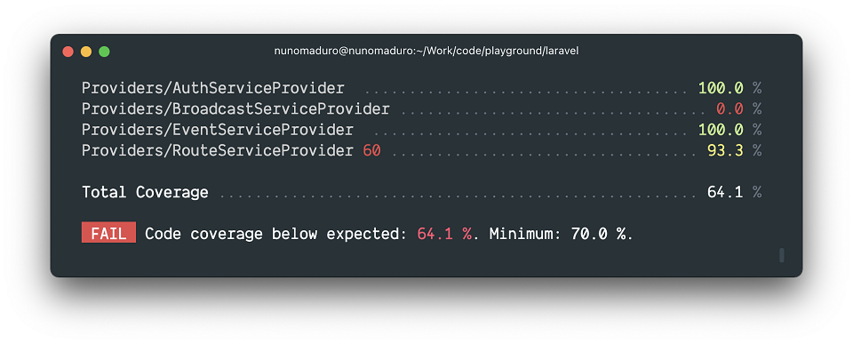
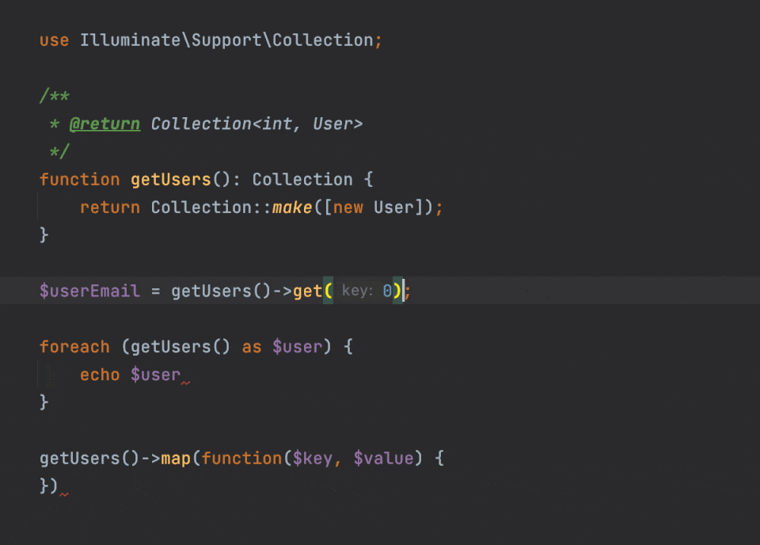

# Laravel 9 · Примечания к релизу

- [Схема версионирования](#versioning-scheme)
- [Политика поддержки](#support-policy)
- [Laravel 9](#laravel-9)

<a name="versioning-scheme"></a>
## Схема версионирования

Laravel и другие его собственные пакеты следуют [Семантическому Версионированию](https://semver.org/lang/ru/). Мажорные релизы фреймворка выпускаются каждый год (предположительно февраль), тогда как минорные и патч-релизы могут выпускаться каждую неделю. Минорные и патч-релизы **никогда** не должны содержать критических изменений.

Ссылаясь на фреймворк Laravel или его компоненты из вашего приложения или пакета, вы всегда должны использовать ограничение версии `^9.0`, поскольку мажорные релизы Laravel действительно включают критические изменения. Однако мы всегда стремимся к тому, чтобы вы могли выполнить обновление до новой мажорной версии в течение дня или менее.

<a name="named-arguments"></a>
### Именованные аргументы

[Именованные аргументы](https://www.php.net/manual/ru/functions.arguments.php#functions.named-arguments) PHP не подпадают под правила обратной совместимости Laravel. При необходимости мы можем переименовать аргументы функции, чтобы улучшить кодовую базу Laravel. Поэтому использовать именованные аргументы при вызове методов Laravel следует осторожно и с пониманием того, что их имена могут измениться в будущем.

<a name="support-policy"></a>
## Политика поддержки

Для всех релизов исправления ошибок предоставляются в течение 18 месяцев, а исправления безопасности – в течение 2 лет. Для всех дополнительных библиотек, включая Lumen, только последний мажорный релиз получает исправления ошибок. Помимо этого, ознакомьтесь с версиями баз данных, которые [поддерживает Laravel](database.md#introduction).

| Версия | PHP (*) | Дата релиза | Исправление ошибок до | Исправления безопасности до |
| --- | --- | --- | --- | --- |
| 6 (LTS) | 7.2 - 8.0 | 3 сентября 2019 | 25 января 2022 | 6 сентября 2022 |
| 7 | 7.2 - 8.0 | 3 марта 2020 | 6 октября 2020 | 3 марта 2021 |
| 8 | 7.3 - 8.1 | 8 сентября 2020 | 26 июля 2022 | 24 января 2023 |
| 9 | 8.0 - 8.1 | 8 февраля 2022 | 8 августа 2023 | 8 февраля 2024 |
| 10 | 8.1 | 7 февраля 2023 | 7 августа 2024 | 7 февраля 2025 |

<!-- <div class="version-colors">
    <div class="end-of-life">
        <div class="color-box"></div>
        <div>End of life</div>
    </div>
    <div class="security-fixes">
        <div class="color-box"></div>
        <div>Security fixes only</div>
    </div>
</div> -->

(*) Поддерживаемые версии PHP

<a name="laravel-9"></a>
## Laravel 9

Как вы, возможно, знаете, Laravel перешел на ежегодные релизы с 8-ой версии Laravel. Раньше мажорные релизы выпускались каждые 6 месяцев. Этот переход предназначен для того, чтобы облегчить бремя обслуживания для сообщества и побудить нашу команду разработчиков выпускать потрясающие, мощные новые функции без внесения критических изменений. Поэтому мы добавили в Laravel 8 множество надежных функций без нарушения обратной совместимости, таких как поддержка параллельного тестирования, улучшенные стартовые комплекты Breeze, улучшения HTTP-клиента и даже новые типы отношений Eloquent, такие как «has one of many».

Поэтому это обязательство по выпуску замечательных новых функций в текущем релизе, вероятно, приведет к тому, что будущие «мажорные» релизы будут в основном использоваться для задач «обслуживания», таких как обновление вышестоящих зависимостей, что можно увидеть в этих примечаниях к релизу.

Laravel 9 продолжает улучшения, сделанные в Laravel 8.x, путем введения поддержки компонентов Symfony 6.0, Symfony Mailer, Flysystem 3.0, улучшенного вывода `route:list`, драйвера `database` Laravel Scout, нового синтаксиса аксессоров / мутаторов Eloquent, неявных привязок маршрутов с типизированными перечислениями и множество других исправлений ошибок и улучшений юзабилити.

<a name="php-8"></a>
### PHP 8.0

Laravel 9.x теперь требует минимальную версию PHP 8.0.

<a name="symfony-mailer"></a>
### Symfony Mailer

_Авторы: [Dries Vints](https://github.com/driesvints)_, [James Brooks](https://github.com/jbrooksuk) и [Julius Kiekbusch](https://github.com/Jubeki).

Предыдущие релизы Laravel использовали библиотеку [Swift Mailer](https://swiftmailer.symfony.com/docs/introduction.html) для отправки исходящей электронной почты. Однако эта библиотека больше не поддерживается, и ее заменил Symfony Mailer.

Ознакомьтесь с [руководством по обновлению](upgrade.md#symfony-mailer), чтобы узнать больше о том, как обеспечить совместимость вашего приложения с Symfony Mailer.

<a name="flysystem-3"></a>
### Flysystem 3.x

_Автор: [Dries Vints](https://github.com/driesvints)_.

Laravel 9.x обновляет зависимость Flysystem до 3.x. Flysystem поддерживает все взаимодействия с файловой системой, предлагаемые фасадом `Storage`.

Ознакомьтесь с [руководством по обновлению](upgrade.md#flysystem-3), чтобы узнать больше о том, как обеспечить совместимость вашего приложения с Flysystem 3.x.

<a name="eloquent-accessors-and-mutators"></a>
### Улучшенные аксессоры / мутаторы Eloquent

_Автор: [Taylor Otwell](https://github.com/taylorotwell)_.

Laravel 9.x предлагает новый способ определения [аксессоров и мутаторов](eloquent-mutators.md#accessors-and-mutators) Eloquent. В предыдущих релизах Laravel единственным способом определения аксессоров и мутаторов было определение префиксных методов в вашей модели следующим образом:

```php
public function getNameAttribute($value)
{
    return strtoupper($value);
}

public function setNameAttribute($value)
{
    $this->attributes['name'] = $value;
}
```

Однако в Laravel 9.x вы можете определить аксессор и мутатор, используя один метод без префикса, указав возвращаемый тип `Illuminate\Database\Eloquent\Casts\Attribute`:

```php
use Illuminate\Database\Eloquent\Casts\Attribute;

public function name(): Attribute
{
    return new Attribute(
        get: fn ($value) => strtoupper($value),
        set: fn ($value) => $value,
    );
}
```

Кроме того, этот новый подход к определению методов доступа будет кэшировать значения объектов, которые возвращаются атрибутом, точно так же, как [пользовательские классы типизации](eloquent-mutators.md#custom-casts):

```php
use App\Support\Address;
use Illuminate\Database\Eloquent\Casts\Attribute;

public function address(): Attribute
{
    return new Attribute(
        get: fn ($value, $attributes) => new Address(
            $attributes['address_line_one'],
            $attributes['address_line_two'],
        ),
        set: fn (Address $value) => [
            'address_line_one' => $value->lineOne,
            'address_line_two' => $value->lineTwo,
        ],
    );
}
```

<a name="enum-casting"></a>
### Типизация `Enum` атрибутов модели Eloquent

> {note} Перечисляемые типы доступны только в [PHP 8.1+](https://www.php.net/manual/ru/language.enumerations.php).

_Автор: [Mohamed Said](https://github.com/themsaid)_.

Eloquent также позволяет вам преобразовывать значения ваших атрибутов в [типизированные перечисления](https://www.php.net/manual/ru/language.enumerations.backed.php) PHP. Для этого вы можете указать атрибут, который вы хотите типизировать, и соответствующий класс перечисления в массиве `$casts` вашей модели:

    use App\Enums\ServerStatus;

    /**
     * Атрибуты, которые должны быть типизированы.
     *
     * @var array
     */
    protected $casts = [
        'status' => ServerStatus::class,
    ];

После того, как вы определили типизацию в своей модели, указанный атрибут будет автоматически преобразован в перечисляемый тип и из него при взаимодействии с атрибутом:

    if ($server->status == ServerStatus::provisioned) {
        $server->status = ServerStatus::ready;

        $server->save();
    }

<a name="implicit-route-bindings-with-enums"></a>
### Неявная привязка в маршрутах с типизированными перечислениями

_Автор: [Nuno Maduro](https://github.com/nunomaduro)_.

В PHP 8.1 появилась поддержка [типизированных перечислений](https://www.php.net/manual/ru/language.enumerations.backed.php). Laravel 9.x позволяет вам указывать типизированным перечислением в определении вашего маршрута, и Laravel будет вызывать маршрут только в том случае, если этот сегмент маршрута соответствует допустимому значению перечисления. В противном случае будет автоматически возвращен 404-ый ответ HTTP. Например, учитывая следующее определение перечисления:

```php
enum Category: string
{
    case Fruits = 'fruits';
    case People = 'people';
}
```

Вы можете определить маршрут, который будет вызываться только в том случае, если сегмент маршрута `{category}` имеет значение `fruits` или `people`. В противном случае Laravel вернет 404-ый ответ HTTP:

```php
Route::get('/categories/{category}', function (Category $category) {
    return $category->value;
});
```

<a name="forced-scoping-of-route-bindings"></a>
### Принудительные ограничения привязки маршрута

_Автор: [Claudio Dekker](https://github.com/claudiodekker)_.

В предыдущих релизах Laravel при желании можно было ограничить вторую модель Eloquent в определении маршрута, чтобы она была дочерней по отношению к предыдущей модели Eloquent. Например, рассмотрим это определение маршрута, которое извлекает пост в блоге по `slug` для конкретного пользователя:

    use App\Models\Post;
    use App\Models\User;

    Route::get('/users/{user}/posts/{post:slug}', function (User $user, Post $post) {
        return $post;
    });

При использовании неявной привязки с измененным ключом в качестве параметра вложенного маршрута, Laravel автоматически задает ограничение запроса для получения вложенной модели своим родителем, используя соглашения, чтобы угадать имя отношения родительской модели. Однако такое поведение ранее поддерживалось Laravel только тогда, когда для привязки дочернего маршрута использовался пользовательский ключ.

Однако в Laravel 9.x теперь вы можете указать Laravel ограничить «дочерние» привязки, даже если ключ не был предоставлен. Для этого вы можете вызвать метод `scopeBindings` при определении вашего маршрута:

    use App\Models\Post;
    use App\Models\User;

    Route::get('/users/{user}/posts/{post}', function (User $user, Post $post) {
        return $post;
    })->scopeBindings();

Или вы можете указать в определении группы маршрутов использовать ограничения привязки:

    Route::scopeBindings()->group(function () {
        Route::get('/users/{user}/posts/{post}', function (User $user, Post $post) {
            return $post;
        });
    });

<a name="controller-route-groups"></a>
### Контроллер для группы маршрутов

_Автор: [Luke Downing](https://github.com/lukeraymonddowning)_.

Вы можете использовать метод `controller`, чтобы определить общий контроллер для всех маршрутов в группе. Затем при определении маршрутов вам нужно только указать метод контроллера, который они вызывают:

    use App\Http\Controllers\OrderController;

    Route::controller(OrderController::class)->group(function () {
        Route::get('/orders/{id}', 'show');
        Route::post('/orders', 'store');
    });

<a name="full-text"></a>
### Полнотекстовые индексы и выражения `where`

_Авторы: [Taylor Otwell](https://github.com/taylorotwell) и [Dries Vints](https://github.com/driesvints)_.

При использовании MySQL или PostgreSQL теперь для создания полнотекстовых индексов может быть добавлен метод `fullText` к определениям столбцов:

    $table->text('bio')->fullText();

Методы `whereFullText` и `orWhereFullText` полнотекстового поиска можно использовать для добавления условий `where` в запрос для столбцов, которые имеют [полнотекстовые индексы](migrations.md#available-index-types). Эти методы будут преобразованы Laravel в соответствующий SQL базы данных. Например, предложение `MATCH AGAINST` будет создано для приложений, использующих MySQL:

    $users = DB::table('users')
               ->whereFullText('bio', 'web developer')
               ->get();

<a name="laravel-scout-database-engine"></a>
### Поисковая система `database` для Laravel Scout

_Авторы: [Taylor Otwell](https://github.com/taylorotwell) и [Dries Vints](https://github.com/driesvints)_.

Если ваше приложение взаимодействует с базами данных малого и среднего размера или имеет небольшую рабочую нагрузку, то вам может быть удобнее начать работу с поисковой системой `database` Scout вместо Algolia или MeiliSearch. Поисковая система базы данных будет использовать выражения `where like` и полнотекстовые индексы при фильтрации результатов из вашей существующей базы данных, чтобы определить применимые результаты поиска для вашего запроса.

Чтобы узнать больше о поисковой системе `database` для Scout, обратитесь к [документации Scout](scout.md).

<a name="rendering-inline-blade-templates"></a>
### Отрисовка встроенных шаблонов Blade

_Авторы: [Jason Beggs](https://github.com/jasonlbeggs) и [Toby Zerner](https://github.com/tobyzerner)_.

Иногда требуется преобразовать строку шаблона Blade в HTML. Вы можете сделать это, используя метод `render` фасада `Blade`. Метод `render` принимает строку шаблона Blade и необязательный массив данных для шаблона:

```php
use Illuminate\Support\Facades\Blade;

return Blade::render('Hello, {{ $name }}', ['name' => 'Julian Bashir']);
```

Точно так же метод `renderComponent` может использоваться для отрисовки переданного класса компонента путем передачи экземпляра компонента в метод:

```php
use App\View\Components\HelloComponent;

return Blade::renderComponent(new HelloComponent('Julian Bashir'));
```

<a name="slot-name-shortcut"></a>
### Упрощение в именовании слота

_Автор: [Caleb Porzio](https://github.com/calebporzio)._

В предыдущих релизах Laravel имена слотов определялись с использованием атрибута `name` в теге `x-slot`:

```blade
<x-alert>
    <x-slot name="title">
        Server Error
    </x-slot>

    <strong>Whoops!</strong> Something went wrong!
</x-alert>
```

Однако, начиная с Laravel 9.x, вы можете указать имя слота, используя удобный, более короткий синтаксис:

```xml
<x-slot:title>
    Server Error
</x-slot>
```

<a name="checked-selected-blade-directives"></a>
### Отмеченные / Выделенные элементы интерфейса

_Авторы: [Ash Allen](https://github.com/ash-jc-allen) и [Taylor Otwell](https://github.com/taylorotwell)_.

Для удобства вы можете использовать директиву `@checked`, чтобы указать, должен ли быть «отмечен» HTML-флажок. Эта директива выведет `checked`, если переданное условие является истинным:

```blade
<input type="checkbox"
        name="active"
        value="active"
        @checked(old('active', $user->active)) />
```

Аналогично, директива `@selected` может использоваться для указания, следует ли «выбрать» указанный элемент выпадающего списка:

```blade
<select name="version">
    @foreach ($product->versions as $version)
        <option value="{{ $version }}" @selected(old('version') == $version)>
            {{ $version }}
        </option>
    @endforeach
</select>
```

<a name="bootstrap-5-pagination-views"></a>
### Шаблоны Bootstrap 5 для постраничной навигации

_Автор: [Jared Lewis](https://github.com/jrd-lewis)_.

Laravel теперь содержит шаблоны для постраничной навигации, созданные с помощью [Bootstrap 5](https://getbootstrap.com/). Чтобы использовать эти шаблоны вместо шаблонов Tailwind по умолчанию, вы можете вызвать метод пагинатора `useBootstrapFive` в методе `boot` поставщика `App\Providers\AppServiceProvider`:

    use Illuminate\Pagination\Paginator;

    /**
     * Загрузка любых служб приложения.
     *
     * @return void
     */
    public function boot()
    {
        Paginator::useBootstrapFive();
    }

<a name="improved-validation-of-nested-array-data"></a>
### Улучшенная валидация данных вложенного массива

_Автор: [Steve Bauman](https://github.com/stevebauman)_.

Иногда требуется получить доступ к значению переданного вложенного элемента массива при назначении правил валидации для атрибута. Вы можете сделать это, используя метод `Rule::foreEach`. Метод `forEach` принимает замыкание, которое будет вызываться для каждой итерации проверяемого атрибута массива, и будет получать значение атрибута и явное, полностью развернутое имя атрибута. Замыкание должно возвращать массив правил предназначенных элементу массива:

    use App\Rules\HasPermission;
    use Illuminate\Support\Facades\Validator;
    use Illuminate\Validation\Rule;

    $validator = Validator::make($request->all(), [
        'companies.*.id' => Rule::forEach(function ($value, $attribute) {
            return [
                Rule::exists(Company::class, 'id'),
                new HasPermission('manage-company', $value),
            ];
        }),
    ]);

<a name="laravel-breeze-api"></a>
### Laravel Breeze API и Next.js

_Авторы: [Taylor Otwell](https://github.com/taylorotwell) и [Miguel Piedrafita](https://twitter.com/m1guelpf)_.

Стартовый комплект [Laravel Breeze](starter-kits.md#breeze-and-next) получил режим формирования «API» и [реализацию внешнего интерфейса](https://github.com/laravel/breeze-next) на [Next.js](https://nextjs.org). Этот стартовый комплект может использоваться для быстрого запуска ваших приложений Laravel, которые служат в качестве бэкэнда с аутентификацией API для внешнего интерфейса JavaScript через Laravel Sanctum.

<a name="exception-page"></a>
### Улучшенная страница исключения Ignition

_Автор: [Spatie](https://spatie.be/)._

Ignition – страница отладки исключений с открытым исходным кодом, созданная Spatie, была переработана с нуля. Ignition поставляется с Laravel 9.x и включает в себя светлые / темные темы, настраиваемую функцию «открыть в редакторе» и многое другое.

<p align="center">

</p>

<a name="improved-route-list"></a>
### Красивый вывод консольной команды `route:list`

_Автор: [Nuno Maduro](https://github.com/nunomaduro)_.

Вывод `route:list` был значительно улучшен в Laravel 9.x и предлагает новый вид при обзоре ваших определений маршрутов.

<p align="center">

</p>

<a name="test-coverage-support-on-artisan-test-Command"></a>
### Отчет о покрытии тестами при использовании команды `test` Artisan

_Автор: [Nuno Maduro](https://github.com/nunomaduro)_.

Команда `test` Artisan получила новую опцию `--coverage`, которую вы можете использовать для изучения объема покрытия кода, которое ваши тесты предоставляют вашему приложению:

```shell
php artisan test --coverage
```

Результаты покрытия тестами будут отображаться непосредственно при выводе в CLI.

<p align="center">

</p>

Вы можете использовать параметр `--min`, чтобы определить минимальный порог покрытия тестами вашего приложения. Набор тестов завершится ошибкой, если этот порог не будет достигнут:

```shell
php artisan test --coverage --min=80.3
```

<p align="center">

</p>

<a name="soketi-echo-server"></a>
### Сервер Soketi Echo

_Автор: [Alex Renoki](https://github.com/rennokki)_.

Хотя это не является эксклюзивным для Laravel 9.x, Laravel недавно помог с документацией Soketi, совместимого с [Laravel Echo](broadcasting.md) сервера Web Socket, написанного для Node.js. Soketi предоставляет отличную альтернативу Pusher и Ably с открытым исходным кодом для тех приложений, которые предпочитают управлять собственным сервером Web Socket.

Для получения дополнительной информации об использовании Soketi обратитесь к [документации по трансляции событий](broadcasting.md) и [документации по Soketi](https://docs.soketi.app/).

<a name="improved-collections-ide-support"></a>
### Улучшенная поддержка IDE для коллекций

_Автор: [Nuno Maduro](https://github.com/nunomaduro)_.

Laravel 9.x добавляет улучшенные определения типов в компонент коллекций, улучшая поддержку IDE и статического анализа. IDE, такие как [PHPStorm](https://blog.jetbrains.com/phpstorm/2021/12/phpstorm-2021-3-release/#support_for_future_laravel_collections) или инструменты статического анализа, такие как [PHPStan](https://phpstan.org) теперь будет лучше понимать коллекции Laravel изначально.

<p align="center">

</p>

<a name="new-helpers"></a>
### Новые глобальные помощники

Laravel 9.x представляет две новые удобные вспомогательные функции, которые вы можете использовать в своем приложении.

<a name="new-helpers-str"></a>
#### `str`

Функция `str` возвращает новый экземпляр `Illuminate\Support\Stringable` переданной строки. Эта функция эквивалентна методу `Str::of`:

    $string = str('Taylor')->append(' Otwell');

    // 'Taylor Otwell'

Если для функции `str` не указан аргумент, то функция возвращает экземпляр `Illuminate\Support\Str`:

    $snake = str()->snake('LaravelFramework');

    // 'laravel_framework'

<a name="new-helpers-to-route"></a>
#### `to_route`

Функция `to_route` генерирует [HTTP-ответ перенаправления](responses.md#redirects) на [именованный маршрут](routing.md#named-routes):

    return to_route('users.show', ['user' => 1]);

При необходимости вы можете передать код состояния HTTP, который должен быть назначен перенаправлению, и любые дополнительные заголовки ответа в качестве третьего и четвертого аргументов метода `to_route`, соответственно:

    return to_route('users.show', ['user' => 1], 302, ['X-Framework' => 'Laravel']);
