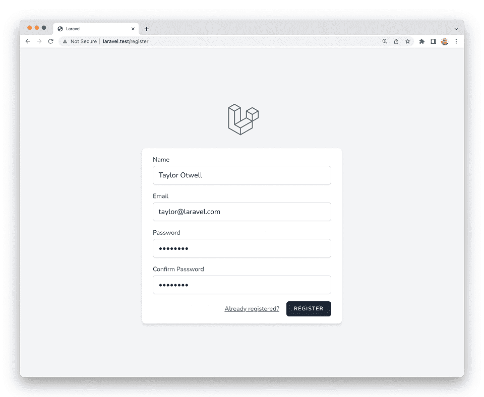

# Laravel 9 · Стартовые комплекты

- [Введение](#introduction)
- [Laravel Breeze](#laravel-breeze)
    - [Установка](#laravel-breeze-installation)
    - [Breeze и React / Vue](#breeze-and-inertia)
    - [Breeze и Next.js / API](#breeze-and-next)
- [Laravel Jetstream](#laravel-jetstream)

<a name="introduction"></a>
## Введение

Чтобы дать вам фору при создании нового приложения, Laravel предлагает стартовые комплекты приложения и, в частности, аутентификации. Эти комплекты автоматически дополнят ваше приложение маршрутами, контроллерами и шаблонами, необходимыми для регистрации и аутентификации пользователей вашего приложения.

Вы можете использовать эти стартовые комплекты, но они не требуются. Вы можете создать собственное приложение с нуля, просто установив новую копию Laravel. В любом случае, мы знаем, что вы создадите что-то отличное!

<a name="laravel-breeze"></a>
## Laravel Breeze

[Laravel Breeze](https://github.com/laravel/breeze) – это минимальная и простая реализация всего [функционала аутентификации](authentication.md) Laravel, включая вход в систему, регистрацию, сброс пароля, подтверждение адреса электронной почты и пароля. Слой «View» комплекта Laravel Breeze по умолчанию состоит из простых [шаблонов Blade](blade.md), стилизованных с помощью [Tailwind CSS](https://tailwindcss.com).

Breeze является прекрасной отправной точкой для создания нового приложения Laravel, а также отличный выбор для проектов, которые планируют вывести использование шаблонов Blade на новый уровень с помощью [Laravel Livewire](https://laravel-livewire.com).



<a name="laravel-breeze-installation"></a>
### Установка

Сначала вы должны [создать новое приложение Laravel](installation.md), настроить свою базу данных и запустить [миграции базы данных](migrations.md):

```shell
curl -s https://laravel.build/example-app | bash

cd example-app

php artisan migrate
```

Создав новое приложение Laravel, вы можете установить Laravel Breeze с помощью Composer:

```shell
composer require laravel/breeze --dev
```

После того, как Composer установит пакет Laravel Breeze, вы можете запустить команду `breeze:install` Artisan. Эта команда опубликует для вашего приложения шаблоны, маршруты, контроллеры и другие ресурсы аутентификации. Laravel Breeze опубликует весь свой код в вашем приложении, чтобы у вас был полный контроль, а также обзор всего функционала и его реализации. После установки Breeze вы также должны скомпилировать свои исходники, чтобы был доступен файл стилей вашего приложения:

```shell
php artisan breeze:install

npm install
npm run dev
php artisan migrate
```

Затем, вы можете перейти в своем веб-браузере по URL-адресам вашего приложения `/login` или `/register`. Все маршруты Breeze определены в файле `routes/auth.php`.

> {tip} Чтобы узнать больше о компиляции CSS и JavaScript вашего приложения, ознакомьтесь с [документацией Laravel Mix](mix.md#running-mix).

<a name="breeze-and-inertia"></a>
### Breeze и React / Vue

Laravel Breeze также предлагает каркасы React и Vue через реализацию внешнего интерфейса [Inertia.js](https://inertiajs.com). Inertia позволяет создавать современные одностраничные приложения React и Vue, используя классическую маршрутизацию и контроллеры на стороне сервера.

Inertia позволяет вам наслаждаться мощью внешнего интерфейса React и Vue в сочетании с невероятной производительностью Laravel. Чтобы использовать стек Inertia, укажите `vue` или `react` в качестве желаемого стека при выполнении команды `breeze:install` Artisan:

```shell
php artisan breeze:install vue

# Или ...

php artisan breeze:install react

npm install
npm run dev
php artisan migrate
```

Если вы хотите, чтобы Breeze поддерживал [Inertia SSR](https://inertiajs.com/server-side-rendering), то вы можете указать параметр `ssr` при вызове команды `breeze:install`:

```shell
php artisan breeze:install vue --ssr
php artisan breeze:install react --ssr
```

<a name="breeze-and-next"></a>
### Breeze и Next.js / API

Laravel Breeze также может создать API-интерфейс аутентификации, готовый для аутентификации современных приложений JavaScript, например, на базе [Next](https://nextjs.org), [Nuxt](https://nuxtjs.org) и других. Для начала укажите стек `api` в качестве желаемого при выполнении команды `breeze:install` Artisan:

```shell
php artisan breeze:install api

php artisan migrate
```

Во время установки Breeze добавит переменную среды `FRONTEND_URL` в файл `.env` вашего приложения. Этот URL-адрес должен быть URL-адресом вашего приложения JavaScript. Обычно во время локальной разработки этим адресом будет `http://localhost:3000`. Кроме того, вы должны убедиться, что для вашего `APP_URL` установлено значение `http://localhost:8000`, которое является URL-адресом по умолчанию, используемым командой `serve` Artisan.

<a name="next-reference-implementation"></a>
#### Доступная реализация Next.js

Теперь вы будете готовы совместить указанный выше бэкэнд с выбранным вами интерфейсом. Реализация Next внешнего интерфейса Breeze доступна на [GitHub](https://github.com/laravel/breeze-next). Этот интерфейс поддерживается Laravel и содержит тот же пользовательский интерфейс, что и традиционные стеки Blade и Inertia, предоставляемые Breeze.

<a name="laravel-jetstream"></a>
## Laravel Jetstream

В то время как Laravel Breeze обеспечивает простую и минимальную отправную точку для создания приложения Laravel, Jetstream дополняет эту функциональность более надежными функциями и дополнительными стеками технологий клиентского интерфейса. **Для тех, кто новичок в Laravel, мы рекомендуем изучить основы работы с Laravel Breeze перед тем, как перейти на Laravel Jetstream.**

Jetstream предлагает красиво оформленный каркас приложений для Laravel и включает в себя вход в систему, регистрацию, подтверждение адреса электронной почты, двухфакторную аутентификацию, управление сессиями, поддержку API через Laravel Sanctum, и дополнительно, управление командой. Jetstream разработан с использованием [Tailwind CSS](https://tailwindcss.com) и предлагает на ваш выбор каркас клиентского интерфейса под управлением [Livewire](https://laravel-livewire.com) либо [Inertia.js](https://inertiajs.com).

Полное описание по установке Laravel Jetstream можно найти в [официальной документации Jetstream](https://jetstream.laravel.com).
