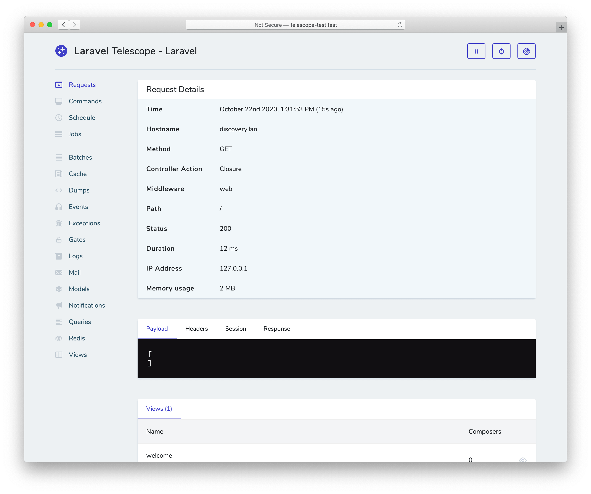

# Laravel 9 · Пакет Laravel Telescope

- [Введение](#introduction)
- [Установка](#installation)
    - [Только локальная установка](#local-only-installation)
    - [Конфигурирование](#configuration)
    - [Очистка накопленных данных](#data-pruning)
    - [Авторизация доступа к панели управления](#dashboard-authorization)
- [Обновление пакета Telescope](#upgrading-telescope)
- [Фильтрация](#filtering)
    - [Фильтрация записей](#filtering-entries)
    - [Фильтрация пакетов](#filtering-batches)
- [Добавление меток](#tagging)
- [Доступные наблюдатели](#available-watchers)
    - [Наблюдатель Batch](#batch-watcher)
    - [Наблюдатель Cache](#cache-watcher)
    - [Наблюдатель Command](#command-watcher)
    - [Наблюдатель Dump](#dump-watcher)
    - [Наблюдатель Event](#event-watcher)
    - [Наблюдатель Exception](#exception-watcher)
    - [Наблюдатель Gate](#gate-watcher)
    - [Наблюдатель HTTP Client](#http-client-watcher)
    - [Наблюдатель Job](#job-watcher)
    - [Наблюдатель Log](#log-watcher)
    - [Наблюдатель Mail](#mail-watcher)
    - [Наблюдатель Model](#model-watcher)
    - [Наблюдатель Notification](#notification-watcher)
    - [Наблюдатель Query](#query-watcher)
    - [Наблюдатель Redis](#redis-watcher)
    - [Наблюдатель Request](#request-watcher)
    - [Наблюдатель Schedule](#schedule-watcher)
    - [Наблюдатель View](#view-watcher)
- [Отображение аватара пользователя](#displaying-user-avatars)

<a name="introduction"></a>
## Введение

[Laravel Telescope](https://github.com/laravel/telescope) станет прекрасным помощником при локальной разработке приложения Laravel. Telescope дает представление о запросах, поступающих в ваше приложение, исключениях, записях журнала, запросах базы данных, поставленных в очередь заданиях, почте, уведомлениях, операциях кэша, запланированных задачах, дампах переменных и о многом другом.



<a name="installation"></a>
## Установка

Для начала установите Telescope с помощью менеджера пакетов Composer в свой проект:

```shell
composer require laravel/telescope
```

После установки Telescope опубликуйте его ресурсы с помощью команды `telescope:install` Artisan. После установки Telescope вы также должны запустить команду `migrate`, чтобы создать таблицы, необходимые для хранения данных Telescope:

```shell
php artisan telescope:install

php artisan migrate
```

<a name="migration-customization"></a>
#### Настройка миграции

Если вы не собираетесь использовать миграции Telescope по умолчанию, то вам следует вызвать метод `Telescope::ignoreMigrations` в методе `register` поставщика `App\Providers\AppServiceProvider`. Вы можете экспортировать миграции по умолчанию, используя следующую команду: `php artisan vendor:publish --tag=telescope-migrations`.

<a name="local-only-installation"></a>
### Только локальная установка

Если вы планируете использовать Telescope только для локальной разработки, то вы можете установить Telescope с параметром `--dev`:

```shell
composer require laravel/telescope --dev

php artisan telescope:install

php artisan migrate
```

После запуска `telescope:install` вы должны удалить регистрацию поставщика `TelescopeServiceProvider` из конфигурационного файла `config/app.php` вашего приложения. Вместо этого самостоятельно зарегистрируйте поставщика службы Telescope в методе `register` поставщика `App\Providers\AppServiceProvider`. Прежде чем зарегистрировать поставщика, убедитесь, что текущее окружение является локальным:

    /**
     * Регистрация любых служб приложения.
     *
     * @return void
     */
    public function register()
    {
        if ($this->app->environment('local')) {
            $this->app->register(\Laravel\Telescope\TelescopeServiceProvider::class);
            $this->app->register(TelescopeServiceProvider::class);
        }
    }

Наконец, вы также должны предотвратить [авто-обнаружение](packages.md#package-discovery) пакета Telescope, добавив в файл `composer.json` следующее:

```json
"extra": {
    "laravel": {
        "dont-discover": [
            "laravel/telescope"
        ]
    }
},
```

<a name="configuration"></a>
### Конфигурирование

После публикации ресурсов Telescope, его основной конфигурационный файл будет расположен в `config/telescope.php`. Этот файл конфигурации позволяет настроить параметры наблюдателя. Каждый параметр конфигурации включает описание своего назначения, поэтому обязательно внимательно изучите этот файл.

При желании вы можете полностью отключить сбор данных Telescope, используя параметр `enabled` конфигурации:

    'enabled' => env('TELESCOPE_ENABLED', true),

<a name="data-pruning"></a>
### Очистка накопленных данных

Если не применять очистку, то таблица `telescope_entries` может очень быстро накапливать записи. Чтобы избежать этого, вы должны [запланировать](scheduling.md) ежедневный запуск команды `telescope:prune` Artisan:

    $schedule->command('telescope:prune')->daily();

По умолчанию все записи старше 24 часов будут удалены. Вы можете использовать параметр `hours` при вызове команды, чтобы определить, как долго хранить данные Telescope. Например, следующая команда удалит все записи, созданные более 48 часов назад:

    $schedule->command('telescope:prune --hours=48')->daily();

<a name="dashboard-authorization"></a>
### Авторизация доступа к панели управления

Доступ к панели управления Telescope можно получить по маршруту `/telescope`. По умолчанию вы сможете получить доступ к этой панели управления только в локальном (`local`) окружении. Однако в поставщике `App\Providers\TelescopeServiceProvider` есть определение [шлюза авторизации](authorization.md#gates). Этот шлюз авторизации контролирует доступ к Telescope в **нелокальных** окружениях. Вы можете изменить этот шлюз, чтобы ограничить доступ к вашей установке Telescope, если это необходимо:

    /**
     * Регистрация шлюза Telescope.
     *
     * Этот шлюз определяют, кто может получить доступ к Telescope в нелокальном окружении.
     *
     * @return void
     */
    protected function gate()
    {
        Gate::define('viewTelescope', function ($user) {
            return in_array($user->email, [
                'taylor@laravel.com',
            ]);
        });
    }

> {note} Убедитесь, что вы изменили значение переменной `APP_ENV` на `production` в эксплуатационном окружении. В противном случае доступ к Telescope будет публичным.

<a name="upgrading-telescope"></a>
## Обновление пакета Telescope

При обновлении до новой мажорной версии Telescope внимательно ознакомьтесь с [руководством по обновлению](https://github.com/laravel/telescope/blob/master/UPGRADE.md).

Кроме того, при обновлении до любой новой версии Telescope вы должны повторно опубликовать ресурсы Telescope:

```shell
php artisan telescope:publish
```

Чтобы поддерживать актуальность ресурсов и избежать проблем в будущих обновлениях, вы можете добавить команду `telescope:publish` в сценарий `post-update-cmd` файла `composer.json` вашего приложения:

```json
{
    "scripts": {
        "post-update-cmd": [
            "@php artisan telescope:publish --ansi"
        ]
    }
}
```

<a name="filtering"></a>
## Фильтрация

<a name="filtering-entries"></a>
### Фильтрация записей

Вы можете фильтровать данные, записываемые Telescope, с помощью замыкания метода `filter`, определенного в поставщике `App\Providers\TelescopeServiceProvider`. По умолчанию это замыкание записывает все данные в локальном окружении, и в нелокальном окружении – исключения, неуспешные задания, запланированные задачи и данные с отслеживаемыми тегами:

    use Laravel\Telescope\IncomingEntry;
    use Laravel\Telescope\Telescope;

    /**
     * Регистрация любых служб приложения.
     *
     * @return void
     */
    public function register()
    {
        $this->hideSensitiveRequestDetails();

        Telescope::filter(function (IncomingEntry $entry) {
            if ($this->app->environment('local')) {
                return true;
            }

            return $entry->isReportableException() ||
                $entry->isFailedJob() ||
                $entry->isScheduledTask() ||
                $entry->isSlowQuery() ||
                $entry->hasMonitoredTag();
        });
    }

<a name="filtering-batches"></a>
### Фильтрация пакетов

В то время как замыкание метода `filter` фильтрует данные для отдельных записей, вы можете использовать метод `filterBatch` для регистрации замыкания, которое фильтрует все данные для текущего запроса или консольной команды. Если замыкание возвращает `true`, то все записи будут записаны Telescope:

    use Illuminate\Support\Collection;
    use Laravel\Telescope\Telescope;

    /**
     * Регистрация любых служб приложения.
     *
     * @return void
     */
    public function register()
    {
        $this->hideSensitiveRequestDetails();

        Telescope::filterBatch(function (Collection $entries) {
            if ($this->app->environment('local')) {
                return true;
            }

            return $entries->contains(function ($entry) {
                return $entry->isReportableException() ||
                    $entry->isFailedJob() ||
                    $entry->isScheduledTask() ||
                    $entry->isSlowQuery() ||
                    $entry->hasMonitoredTag();
                });
        });
    }

<a name="tagging"></a>
## Добавление меток

Telescope позволяет искать записи по «метке». Часто метки представляют собой имена классов модели Eloquent или идентификаторы аутентифицированных пользователей, которые Telescope автоматически добавляет к записям. По желанию можно прикрепить к записям свои собственные метки. Для этого вы можете использовать метод `Telescope::tag`. Метод `tag` принимает замыкание, которое должно возвращать массив меток. Метки, возвращаемые замыканием, будут объединены с любыми метками, которые Telescope автоматически прикрепит к записи. Как правило, вызов метода `tag` осуществляется в методе `register` вашего класса `App\Providers\TelescopeServiceProvider`:

    use Laravel\Telescope\IncomingEntry;
    use Laravel\Telescope\Telescope;

    /**
     * Регистрация любых служб приложения.
     *
     * @return void
     */
    public function register()
    {
        $this->hideSensitiveRequestDetails();

        Telescope::tag(function (IncomingEntry $entry) {
            return $entry->type === 'request'
                        ? ['status:'.$entry->content['response_status']]
                        : [];
        });
     }

<a name="available-watchers"></a>
## Доступные наблюдатели

«Наблюдатели» Telescope собирают данные приложения при выполнении запроса или консольной команды. Вы можете изменить список наблюдателей, которые вам необходимо задействовать, в конфигурационном файле `config/telescope.php`:

    'watchers' => [
        Watchers\CacheWatcher::class => true,
        Watchers\CommandWatcher::class => true,
        ...
    ],

Некоторые наблюдатели также содержат параметры дополнительных настроек:

    'watchers' => [
        Watchers\QueryWatcher::class => [
            'enabled' => env('TELESCOPE_QUERY_WATCHER', true),
            'slow' => 100,
        ],
        ...
    ],

<a name="batch-watcher"></a>
### Наблюдатель Batch

Наблюдатель записывает информацию о [пакетах](queues.md#job-batching) в очереди, включая информацию о задании и соединении.

<a name="cache-watcher"></a>
### Наблюдатель Cache

Наблюдатель записывает данные, когда ключ кеша был запрошен (точнее, возврат значения либо его отсутствие), обновлен или удален.

<a name="command-watcher"></a>
### Наблюдатель Command

Наблюдатель записывает аргументы, параметры, код выхода и вывод всякий раз, когда выполняется команда Artisan. Если вы хотите исключить определенные команды из записываемых наблюдателем, то вы можете указать команду в параметре `ignore` в вашем файле `config/telescope.php`:

    'watchers' => [
        Watchers\CommandWatcher::class => [
            'enabled' => env('TELESCOPE_COMMAND_WATCHER', true),
            'ignore' => ['key:generate'],
        ],
        ...
    ],

<a name="dump-watcher"></a>
### Наблюдатель Dump

Наблюдатель записывает и отображает дампы переменных в Telescope. При использовании Laravel переменные могут быть выведены с помощью глобальной функции `dump`. Чтобы дамп был записан, должна быть открыта вкладка в браузере наблюдателя за дампом, в противном случае вывод будет игнорироваться наблюдателем.

<a name="event-watcher"></a>
### Наблюдатель Event

Наблюдатель записывает полезную нагрузку, слушателей и трансляцию данных любых [событий](events.md), инициированных вашим приложением. Внутренние события фреймворка Laravel игнорируются данным наблюдателем.

<a name="exception-watcher"></a>
### Наблюдатель Exception

Наблюдатель записывает данные и трассировку стека для любых отчетных исключений, которые генерируются вашим приложением.

<a name="gate-watcher"></a>
### Наблюдатель Gate

Наблюдатель записывает данные и результаты проверок [шлюза и политик](authorization.md) вашего приложения. Если вы хотите исключить определенные полномочия из записываемых наблюдателем, то вы можете указать их в параметре `ignore_abilities` в вашем файле `config/telescope.php`:

    'watchers' => [
        Watchers\GateWatcher::class => [
            'enabled' => env('TELESCOPE_GATE_WATCHER', true),
            'ignore_abilities' => ['viewNova'],
        ],
        ...
    ],

<a name="http-client-watcher"></a>
### Наблюдатель HTTP Client

Наблюдатель HTTP Client записывает исходящие [запросы HTTP Client](http-client.md), сделанные вашим приложением.

<a name="job-watcher"></a>
### Наблюдатель Job

Наблюдатель записывает данные и статус любых [заданий](queues.md), инициированных вашим приложением.

<a name="log-watcher"></a>
### Наблюдатель Log

Наблюдатель записывает данные всех [журналов](logging.md), созданных вашим приложением.

<a name="mail-watcher"></a>
### Наблюдатель Mail

Наблюдатель позволяет вам просматривать в браузере [письма](mail.md), отправленные вашим приложением, вместе с соответствующими данными. Вы также можете загрузить электронное письмо в виде файла `.eml`.

<a name="model-watcher"></a>
### Наблюдатель Model

Наблюдатель записывает изменения модели всякий раз, когда инициируется [событие модели](eloquent.md#events) Eloquent. Вы можете указать, какие события модели должны быть записаны с помощью параметра `events` наблюдателя:

    'watchers' => [
        Watchers\ModelWatcher::class => [
            'enabled' => env('TELESCOPE_MODEL_WATCHER', true),
            'events' => ['eloquent.created*', 'eloquent.updated*'],
        ],
        ...
    ],

Если вы также хотите записывать количество затронутых во время запроса моделей, то используйте параметр `hydrations`:

    'watchers' => [
        Watchers\ModelWatcher::class => [
            'enabled' => env('TELESCOPE_MODEL_WATCHER', true),
            'events' => ['eloquent.created*', 'eloquent.updated*'],
            'hydrations' => true,
        ],
        ...
    ],

<a name="notification-watcher"></a>
### Наблюдатель Notification

Наблюдатель записывает все [уведомления](notifications.md), отправленные вашим приложением. Если уведомление включает отправку электронного письма и у вас включен почтовый наблюдатель, то письмо также будет доступно для предварительного просмотра на экране почтового наблюдателя.

<a name="query-watcher"></a>
### Наблюдатель Query

Наблюдатель записывает сырой SQL, связывания и время выполнения для всех запросов, инициированных вашим приложением. Наблюдатель также помечает любые запросы превышающие 100 миллисекунд как `slow` (медленные). Вы можете изменить порог медленного запроса, используя параметр `slow` наблюдателя:

    'watchers' => [
        Watchers\QueryWatcher::class => [
            'enabled' => env('TELESCOPE_QUERY_WATCHER', true),
            'slow' => 50,
        ],
        ...
    ],

<a name="redis-watcher"></a>
### Наблюдатель Redis

Наблюдатель записывает все команды [Redis](redis.md), инициированные вашим приложением. Если вы используете Redis для кеширования, то команды кеширования также будут записываться наблюдателем Redis.

<a name="request-watcher"></a>
### Наблюдатель Request

Наблюдатель записывает данные запроса, заголовки, сессию и ответ, связанные с любым запросом, обрабатываемым приложением. Вы можете ограничить записываемые данные ответа с помощью параметра `size_limit` (в килобайтах):

    'watchers' => [
        Watchers\RequestWatcher::class => [
            'enabled' => env('TELESCOPE_REQUEST_WATCHER', true),
            'size_limit' => env('TELESCOPE_RESPONSE_SIZE_LIMIT', 64),
        ],
        ...
    ],

<a name="schedule-watcher"></a>
### Наблюдатель Schedule

Наблюдатель записывает команды и результаты выполнения любых [запланированных задач](scheduling.md), инициированных вашим приложением.

<a name="view-watcher"></a>
### Наблюдатель View

Наблюдатель записывает имя [шаблона](views.md), путь, данные и «компоновщики», используемые при отрисовки шаблонов.

<a name="displaying-user-avatars"></a>
## Отображение аватара пользователя

В панели управления Telescope отображается аватар пользователя, который был аутентифицирован при сохранении каждой записи. По умолчанию Telescope получает аватары с помощью веб-службы Gravatar. Однако вы можете изменить URL-адрес аватара, зарегистрировав замыкание в своем классе `App\Providers\TelescopeServiceProvider`. Замыкание получит идентификатор пользователя и адрес электронной почты и должен вернуть URL-адрес изображения аватара пользователя:

    use App\Models\User;
    use Laravel\Telescope\Telescope;

    /**
     * Регистрация любых служб приложения.
     *
     * @return void
     */
    public function register()
    {
        // ...

        Telescope::avatar(function ($id, $email) {
            return '/avatars/'.User::find($id)->avatar_path;
        });
    }
